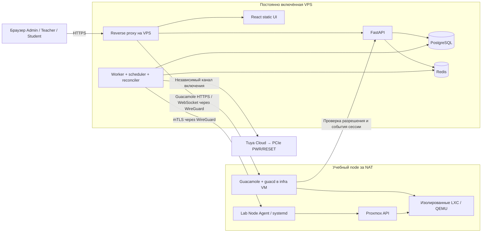

# Целевая архитектура

Основание: ТЗ §§1–2, 13–14, 20–27, 40–50, 62, 66–72. Ниже — проектная декомпозиция для реализации полного продукта с приоритетом [решений пользователя](decisions.md).

## Размещение и границы доверия

Это логическая схема, не готовый firewall. Только нужные соединения разрешаются явно. WireGuard защищает транспорт, mTLS связывает запрос с идентичностью node. Студент не получает туннель или маршрут к node. WireGuard на выключенном сервере не может доставить команду включения.

Guacamole находится рядом с машинами, в отдельной инфраструктурной VM с собственными ограничениями, не в учебной сети без фильтрации. Её ресурсы входят в инфраструктурный reserve. Агент не отдаёт произвольный shell API. Конкретные минимальные привилегии и host helper проверяются на выбранном Proxmox; не обещается, что все сетевые операции доступны непривилегированному процессу без helper.

## Приложения

| Компонент | Ответственность | Не его ответственность |
|---|---|---|
| apps/api | HTTP, authentication, authorization, доменные команды, read models | Долгое ожидание clone/start внутри HTTP, управление VM из endpoint напрямую |
| API worker | Durable jobs, scheduler, orchestration, idle, reconciliation, retention recommendations | Самостоятельно расширять права или удалять неизвестные объекты |
| apps/node-agent | Проверка типизированных команд, журнал исполнения, провайдеры Proxmox/network/storage, telemetry | Пользовательские аккаунты, распределение квот между преподавателями |
| apps/web | Ролевые экраны, прогресс, предупреждения, Guacamole flow | Окончательное решение о capacity или доступе |
| Guacamole extension/bridge | Авторизация конкретного подключения, revoke, server-side session events | Отдельная база пользовательских паролей Lab Manager |

Модульный монолит — постоянная архитектура, а не временный общий файл. API и worker используют одинаковые application/domain modules. Agent выпускается отдельно. Не требуется создавать микросервис на каждую сущность.

## Модули backend и зависимости

`identity`, `permissions`, `groups`, `catalog`, `bookings`, `environments`, `runtimes`, `operations`, `scheduler`, `nodes`, `networking`, `access`, `storage`, `audit`, `observability`.

В каждом модуле разделяются domain, application services, ports и adapters. Domain не импортирует FastAPI, HTTP-клиент Proxmox или Guacamole. HTTP schemas не служат ORM entities. Чтение чужого aggregate через application query разрешено; запись в его таблицы в обход владельца модуля — нет.

Порты: `VirtualizationProvider`, `PowerProvider`, `AccessProvider`, `NetworkProvider`; дополнительно `StorageProvider`, `ArchiveProvider`, `IdentityProvider`, `SecretStore`, `Clock`. Guacamole — единственная пользовательская реализация AccessProvider. Тестовый fake не попадает в production wiring.

Метаданные провайдера помещаются в отдельные bindings. Domain Runtime имеет собственный UUID, а `proxmox_vmid` — внешний идентификатор. Все внешние операции имеют versioned DTO и bounded inputs.

## Источник истины

| Информация | Источник |
|---|---|
| Пользователи, membership, права, желаемая конфигурация | PostgreSQL |
| Операции, резервы, active run, аудит, архивные manifests | PostgreSQL |
| Реальный power/process/disk/network status | Свежий inventory провайдера с timestamp/boot generation |
| Guacamole connections и их жизненный цикл | Серверные события gateway + сверка с действующими сессиями |
| Кеш и сигнал о новом событии | Redis, допускает восстановление из PostgreSQL |

PostgreSQL не делает состояние железа истинным, а Proxmox inventory не назначает права пользователя. Reconciliation сопоставляет два источника, не перезаписывая намерение произвольной наблюдаемой величиной.

## Выполнение команды

1. API проверяет actor, владение, permission revision, current state и idempotency key.
2. В короткой SQL-транзакции создаёт Operation и outbox, меняет desired state. Для allocation применяется протокол ledger из [scheduling.md](scheduling.md).
3. Worker захватывает job с lease и fencing generation. Сетевые вызовы происходят вне SQL-транзакции.
4. Agent принимает идентификатор команды и поколение операции, сохраняет dedup record до эффекта. Повторный запрос получает существующий результат или статус.
5. Provider task ID и ownership markers позволяют восстановить результат после обрыва. Потерявший lease worker не получает право повторно разрушать ресурсы.
6. Worker подтверждает observed state, активирует/освобождает соответствующее allocation, пишет audit и событие UI. При неопределённости операция ждёт сверки; ошибочный rollback не удаляет существующие диски.

Доставка как минимум один раз; «exactly once через сеть» не обещается. Требуется идемпотентный эффект и обнаружение уже начатого provider task. Для агента предлагается локальный файловый журнал с fsync/atomic rename либо иной durable store; его формат — отдельная проверка D1. Это не замена основной PostgreSQL временной SQLite.

## Отказоустойчивость и видимость

При недоступном node VPS продолжает обслуживать вход, группы и каталог, показывает время последней телеметрии. Операции, требующие фактов с node, ждут либо отказываются с объяснением. Состояние UNKNOWN не выводится как STOPPED.

При недоступной DB новые изменения и connection grants запрещаются. Потеря Redis не теряет jobs: worker сканирует durable pending operations, UI перечитывает снимок. Политика завершения уже открытых Guacamole sessions при потере control plane задаётся bounded lease и проверяется отдельно; она не зависит только от браузерного heartbeat.

SSE предлагается для состояния и прогресса; WebSocket используется Guacamole. События содержат sequence/version и проходят те же проверки доступа, что REST. При пропущенной истории клиент перечитывает snapshot. Отключение вкладки не отменяет операцию.

## Технологический baseline

Стек ТЗ сохраняется: Python 3.13+, FastAPI, SQLAlchemy 2, Pydantic, Alembic, PostgreSQL, Redis; React/TypeScript/Vite/TanStack Query/React Router; systemd для agent; Docker Compose для VPS. На первом этапе выбирается поддерживаемый patch Python и совместимые версии, создаются lockfiles и фиксируются образы. Непроверенные номера версий здесь не объявляются production baseline.

Проектное решение — долговечный worker, а не `BackgroundTasks` в API. Документация FastAPI описывает выполнение background tasks после ответа и отдельно обсуждает отдельные процессы для более тяжёлых задач; гарантию crash recovery обеспечивает наш журнал операций, а не сам этот API. [FastAPI Background Tasks](https://fastapi.tiangolo.com/tutorial/background-tasks/).

Одна SQLAlchemy Session/AsyncSession относится к одной единице работы; её нельзя разделять между конкурентными задачами. [SQLAlchemy Session Basics](https://docs.sqlalchemy.org/en/20/orm/session_basics.html).

## Принятые уточнения

Local signup + Admin recovery; независимые Teacher; одна Demo на Environment; resource calendar; authenticated teacher assistance; kick с удалением данных в выбранной Group. QEMU hibernate/LXC shutdown освобождают compute после подтверждения, disks и state files остаются. Archive только soft; backup disabled; snapshots Admin-only. Template in-place upgrade отсутствует. Развёртывание с нуля описано в [deployment-from-zero.md](deployment-from-zero.md).
