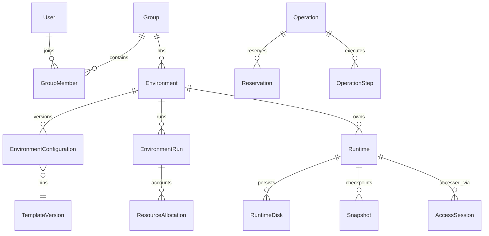

# Домен и схема данных

Основание: ТЗ §§2–10, 16–19, 24–36, 42, 51–55, 66, 70. Это проект схемы перед миграциями, не существующая база. Актуальные изменения — [decisions.md](decisions.md).

## Общие правила

UUID — идентификатор домена; provider IDs отдельно. Время — UTC `timestamptz`. Дисковые объёмы хранятся как целые bytes, RAM/swap — целые MiB, vCPU — integer, CPU admission — целые milli-credits (1000 = 1 credit), CPU limit — fixed precision numeric. Поля `memory_mb`/`disk_gb` из ТЗ получают задокументированную конвертацию; UI не смешивает GiB и десятичные GB. Не использовать float для ledger.

Изменяемые aggregates имеют `version` для optimistic concurrency. Таблицы со статусом получают CHECK/enum validation, timestamps, foreign keys, индексы по ownership/state. JSON допустим для provider metadata, manifests и исторического configuration snapshot, но не заменяет queryable права, квоты, связи и allocations.

Удаление DB-строки не удаляет гипервизорный ресурс. Удаление User/Group/Environment не запускает каскад уничтожения дисков. Идентичности для аудита и восстановления сохраняются как tombstones в соответствии с будущей retention policy.

## Identity, permissions, groups

| Сущность | Основные поля и ограничения |
|---|---|
| User | id, display_name, status, auth_version, created_at; `ACTIVE/SUSPENDED/DELETED` |
| UserRole | user_id, role; unique pair, поддержка нескольких ролей без выдачи роли Student по коду группы |
| ExternalIdentity | user_id, issuer, subject; unique(issuer, subject), email не ключ сопоставления SSO |
| LocalCredential | user_id, password_hash, updated_at; обязательная local auth, plaintext отсутствует |
| BrowserSession | id, user_id, session_token_digest, auth_revision, created_at, expires_at, revoked_at; серверная сессия Lab Manager, общая привязка для grants |
| TeacherProfile / StudentProfile | user_id PK/FK, профильные метаданные; никакого дублирования credentials |
| TeacherPermissionPolicy | id, name, current_revision_id, enabled |
| TeacherPermissionPolicyRevision | id, policy_id, revision, created_by, created_at; immutable, unique(policy_id, revision) |
| PolicyPermission / PolicyLimit | policy_revision_id, permission/limit key, typed value; unique(policy_revision_id, key) |
| TeacherPolicyAssignment | teacher_id, policy_revision_id, assigned_at, assigned_by; применение новой revision — явная атомарная смена с аудитом |
| TeacherPermissionOverride / TeacherLimitOverride | teacher_id, key, explicit value; отсутствие строки означает inherit |
| DemoProfileGrant | teacher/policy, profile_version_id; отдельное разрешение конкретного demo-профиля |
| Group | id, name, owner_teacher_id, join_enabled, archived_at, version |
| GroupJoinCode | group_id, normalized_code_digest, ciphertext для показа учителю, key_version, revoked_at; уникальный активный digest |
| GroupMember | group_id, student_id, joined_at, status, removed_at, banned_by; unique pair, `ACTIVE/REMOVING/REMOVED/BANNED`, отдельная ссылка на cleanup Operation |

Код генерируется криптографически случайно из алфавита ТЗ, длина по policy (пример 6), проверяется транзакционной уникальностью с retry. Нормализация case-insensitive; опечатка `0/O` не исправляется в иной действующий код. Для короткого пространства используется keyed digest, не простой hash для защиты от перебора дампа. Старый код после регенерации не действует. Ban относится к membership, переживает смену кода.

Каждая Group имеет одного владельца Teacher. Co-teacher/delegation удалены из текущего дизайна по DEC-08. Admin может передавать владение отдельным процессом с проверкой квот. История policy/overrides и ownership сохраняется для аудита.

## Каталог и конфигурация

| Сущность | Основные поля и ограничения |
|---|---|
| EnvironmentProfile | id, name, current_version_id, enabled, OS family |
| ProfileVersion | id, profile_id, version, runtime_kind, default resources, network/idle/persistence/snapshot policies, Guacamole protocol; immutable |
| ProfileRequiredPermission | profile_version_id, permission key; требования к student runtime отдельно от demo |
| Template | id, name, runtime_kind, enabled |
| TemplateVersion | id, template_id, version, digest, provenance, status, protocol readiness, OS metadata; immutable version |
| TemplateReplica | template_version_id, provider_scope_id, node_id, storage_pool_id, provider_ref; доступность копии на конкретном node |
| EnvironmentConfiguration | id, environment_id, revision, profile_version_id, template_version_id, runtime_kind, memory, swap, vcpu, cpu_limit, cpu_credits, disk quota, policies; immutable revision |
| NetworkPolicy / IdlePolicy / SnapshotPolicy / PersistencePolicy | versioned policy с typed core fields; persistent disk — базовая обязательная модель |

Существующий Environment закрепляет версии профиля, template и policies. Обновление каталога влияет только на новые Environment. Новый участник получает закреплённую конфигурацию, а не `latest`. QEMU сохраняет RAM на диск, LXC — filesystem. RAM-only pause не является завершением пары; snapshots и state files не заменяют backup.

Смена template/runtime kind существующего Environment запрещена DEC-14. Для другой конфигурации создаётся новое Environment; старое не переустанавливается. Live resize — только разрешённый и поддержанный provider capability; уменьшение диска через обычный PATCH запрещено проектом.

## Environments, runs, runtimes

| Сущность | Основные поля и ограничения |
|---|---|
| Environment | id, name, group_id, owner_teacher_id, billing_teacher_id, node_id, configuration_id, state, desired_state, archive_state, version, created_at, updated_at, last_started_at, last_stopped_at |
| EnvironmentRun | id, environment_id, started_by, requested_at, started_at, stopped_at, state, configuration_id, permission_revision, membership_revision, failure_reason; unique незавершённый run на environment |
| EnvironmentRunParticipant | run_id, runtime_id, member_user_id, admitted_at, readiness/outcome; unique(run_id, runtime_id), история состава |
| Runtime | id, environment_id, role (`STUDENT/DEMO`), student_id/teacher_id, node_id, configuration_id, desired_state, observed_state, observed_at, observation_generation, lifecycle status, stop_reason, last_activity_at, last_started_at, last_stopped_at, created_at |
| DemoRuntime | доменная специализация Runtime c role=DEMO; отдельные demo_config/profile, owner teacher, network participation, snapshot policy; общая инфраструктура lifecycle и disks |
| ProviderRuntimeBinding | runtime_id, provider_scope_id, provider_runtime_id, node_id, provider_kind, ownership_marker, generation; уникальность provider ID в его scope |
| RuntimeCredential | runtime_id, purpose, encrypted_secret/secret_ref, key_version, rotation_version, reveal_policy; отдельные guest и service credentials |
| RuntimeDisk | id, runtime_id, storage_pool_id, provider_ref, logical_quota_bytes, physical_observed_bytes nullable, observation_at, state, provenance |

Домен сохраняет различие Runtime студента и DemoRuntime преподавателя. Предлагаемое физическое представление — общий `runtimes` с discriminator и 1:1 `demo_runtime_settings`. Это позволяет Snapshot, Allocation, GuacamoleConnection и Disk ссылаться на одну machine identity без небезопасных полиморфных FK.

Обязательные ограничения:

- Unique `(environment_id, student_id)` для действующих STUDENT Runtime, включая остановленные/архивные; deleted tombstones исключаются partial index. После kick данные удалены: повторное разрешённое вступление создаёт новую generation без восстановления старых данных. Tombstone не является рабочей машиной.
- Partial unique `(environment_id)` для DEMO. CHECK: STUDENT требует student_id и запрещает teacher_id; DEMO требует teacher_id и запрещает student_id. Дополнительные поля demo допустимы только при role=DEMO (constraint trigger или эквивалентная миграционная проверка).
- Node Runtime согласован с назначением Environment; автоматическое перемещение существующего диска между node не подразумевается.
- Unique `(provider_scope_id, provider_runtime_id)`: для Proxmox scope — кластер, даже если сейчас один node. Локальная уникальность только по node недостаточна для кластера.
- Внешние VMID/IP назначаются атомарно через provider/IPAM, без hardcoded примеров из ТЗ. VMID сохраняется до полного завершения удаления и сверки.
- REMOVING membership закрывает доступ и запускает подтверждённую очистку Runtime этого Student в этой Group; ACTIVE membership проверяется при каждом доступе.
- Partial unique active run (`REQUESTED/STARTING/RUNNING/STOPPING/RECOVERING`) на environment; ошибки без живых ресурсов могут завершать run, ошибки с неопределёнными ресурсами — нет.

Demo обязательна по DEC-07: одна на запускаемый Environment. До provisioning её запись может ещё отсутствовать, но запрет demo profile не создаёт допустимое окружение без Demo.

## Nodes, network, storage

| Сущность | Основные поля и ограничения |
|---|---|
| Node | id, provider_scope_id, display_name, desired_power_state, observed_state, observed_at, boot_id, drain_generation, ready capabilities |
| NodeCondition / NodeInventory | node_id, sequence, sampled_at, received_at, tunnel/proxmox/agent/network/storage/guacamole conditions, physical resources |
| PowerProviderConfig | id, node_id, kind, encrypted credential refs, typed config, independent transport description |
| NetworkAllocation | id, environment_id, node_id, policy_version, applied_revision, status; aggregate выделенной окружению сети с одним или несколькими сегментами |
| NetworkSegment | id, allocation_id, node_id, provider_segment_ref, CIDR, isolation_scope, runtime_id nullable; отдельный L2 для каждого ISOLATED Runtime либо общий GROUP_LAN сегмент |
| RuntimeNetworkAttachment | runtime_id, segment_id, address_lease_id, MAC, role, applied_acl_revision; unique(segment_id, MAC), только разрешённый сегмент |
| AddressLease | id, segment_id, runtime_id, IP, generation, state; unique(segment_id, IP) для неосвобождённых leases, reuse после подтверждённого detach |
| StoragePool | id, node/provider scope, backend, capacity, capabilities, thresholds, inventory freshness |
| StorageUsageSnapshot | pool_id, sampled_at, physical/data/metadata usage, free, logical committed, category breakdown, unknown bytes |
| Snapshot | id, runtime_id, provider_ref, created_by, state, consistency, quota/reserve, observed_size nullable, retention, dependencies |
| StorageDependency | parent resource, child resource, dependency type, verified_at; типизированные FK либо единый StorageObject registry |
| ArchiveArtifact | id, environment/runtime, format, destination ref, manifest/digest, verify/restore status, size, retention, source generation |
| CleanupCandidate | id, storage_object_id, reason, observed_version, discovered_at; safe_to_delete вычисляется заново |

IP management адресов и Runtime присутствуют в закрытых provider models; student-facing DTO их не публикует как внешние endpoints. Guest root всё равно видит свою сеть.

## Ресурсы и надёжность

| Сущность | Назначение |
|---|---|
| ResourceLedger | Сериализуемые бюджетные строки teacher/node/storage; lock order определён в scheduler |
| Reservation | Временное обещание операции, lifecycle и resource class; compute и storage раздельно |
| ResourceAllocation | Долгоживущий учёт выделенного ресурса; compute до закрытия run, disk до подтверждённого удаления |
| Operation / OperationStep | actor, target IDs, idempotency_key+request_digest, expected_version, state, job lease, fencing token, attempt, error, provider task ref |
| OutboxEvent | Транзакционный факт для доставки worker/UI/audit consumer; sequence, aggregate version, delivered_at |
| AccessGrant | Одноразовое разрешение на runtime/user/run/browser_session_id, authorization revision, expiry, nonce digest, redeemed/revoked state; raw token не хранится в audit |
| GuacamoleConnection | runtime_id, gateway_id, provider_connection_ref, config generation, state; server-side credentials references |
| AccessSession | user_id, runtime_id, run_id, grant_id, connection_id, connected_at, disconnected_at, observed_at, last_activity, revoke state |
| GatewayLease | gateway_id, epoch, expires_at, last_heartbeat; ограничивает авторизованную работу при потере control plane |
| AccessEvent | session_id, gateway_epoch, sequence, event_type, observed_at; unique(gateway_id, gateway_epoch, sequence) для повторяемой доставки |
| AuditEvent | actor, action, target, operation/correlation IDs, timestamp, outcome, redacted metadata; append-only для application роли |
| Alert | category, resource_id, severity, active/resolved/acknowledged, first/last seen; dedup по причине и ресурсу |
| DestructivePlan | explicit object IDs, versions, dependency fingerprint, estimated impact, actor, expiry, consumed_at |

Обязательные сущности §51 сохранены; дополнительные таблицы закрывают требуемые workflows. `allocated_resources` и `active_students` в EnvironmentRun — исторический snapshot/read model, а не второй ledger для принятия решений.

## ER-обзор

## Миграционная стратегия

Сначала PostgreSQL schema для identity/ownership, configuration, states и durable operations; затем accounting/network/storage/access таблицы в той же целевой модели. Каждая итерация добавляет полный инвариант своего модуля. Начальный SQL dump не подменяет Alembic migrations.

Auth определена: local signup и Admin recovery. Archive определён: SOFT_ARCHIVE без ArchiveArtifact export. Остальные ключи и lifecycle могут развиваться независимо. Migration tests проверяют чистую установку и обновление на PostgreSQL, unique/check/FK и конкурентные вставки. Разрушительный downgrade с данными не объявляется безопасным автоматически.

## Модели, добавленные после ответов пользователя

| Сущность | Поля и инварианты |
|---|---|
| PasswordResetGrant | user_id, issued_by_admin, token_digest, expires_at, consumed_at; одноразовый reset, audit без пароля |
| ScheduleBooking / BookingResourceClaim | owner_teacher_id, environment_id, node_id, starts_at, ends_at, accepted_sequence, state, config/roster revisions, interval resources, transition margins; [bookings.md](bookings.md) |
| HibernateStateArtifact | runtime_id, generation, provider_ref, storage_pool_id, reserved_bytes, observed_bytes, compatibility metadata, state; только QEMU, один актуальный resume state, не snapshot/backup |
| AssistanceGrant | teacher_id, student_id, runtime_id, active_tunnel_id, mode=view/control, expiry, authorization revision; scope только own Environment |
| GroupMemberRemoval | group_id, student_id, destructive_plan_id, operation_id, state, data_deleted_at; delete target включает архивные Environment группы, но не другие группы |
| TemplateNetworkDefaults | template_version_id, Internet default, isolation mode, named segment definitions; profile overrides допустимы только в Admin policy |

ArchiveArtifact/ArchiveProvider остаются расширяемыми интерфейсами, но cold export/backup workflow отключён и не является release acceptance. SOFT_ARCHIVE хранит status/время/инициатора на Environment. HibernateStateArtifact — действующая обязательная модель и disk commitment.

Runtime состояния дополнены HIBERNATING/HIBERNATED/RESUMING. EndSessionPolicy закреплена: QEMU_HIBERNATE и LXC_SHUTDOWN. NetworkSegment может иметь несколько экземпляров на Environment; attachment/routes остаются в его security boundary. Нельзя ссылаться на management segment по пользовательскому ID.
